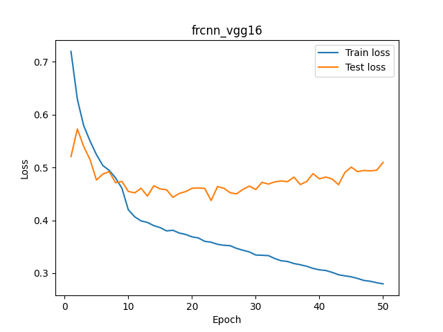
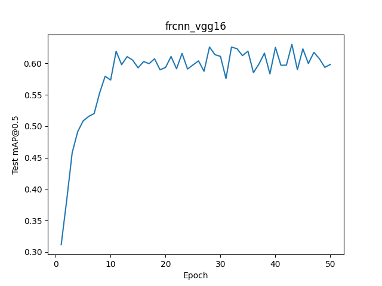
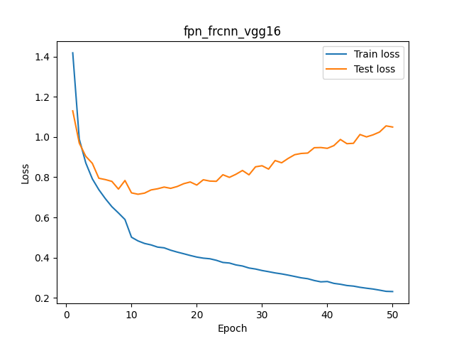
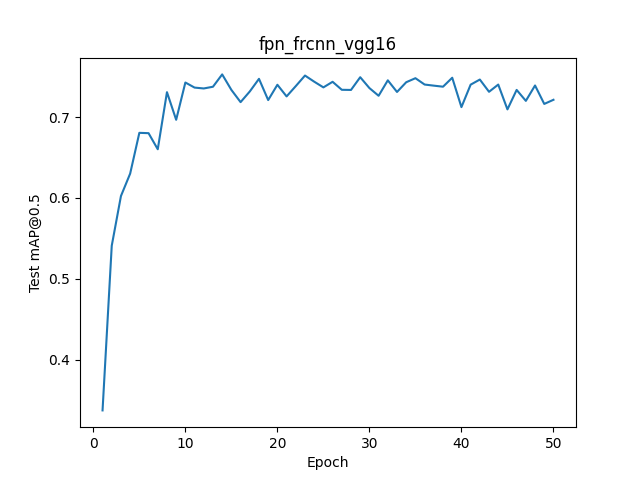
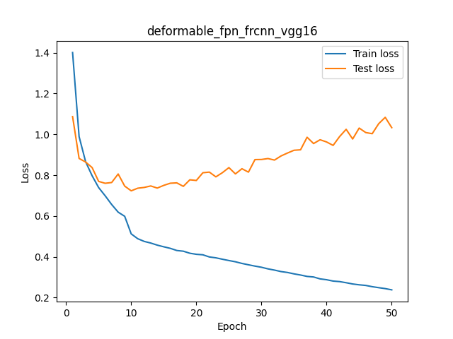

# Модификация 4

## Baseline VGG16

График функции потерь за 50 эпох:

График функции mAP@0.5 за 50 эпох:

* Train Loss монотонно уменьшается
* Test Loss сначала уменьшается но, после ~**30** эпох вновь начинает расти
* После ~**10** эпох mAP@0.5 выходит на плато и не возрастает.
* mAP достигает максимального значения на **28** эпохе (`62.60`). Это и есть состояние модели, при котором она полностью обучена.

## VGG16 + FPN

График функции потерь за 50 эпох:

График функции mAP@0.5 за 50 эпох:

* Train Loss монотонно уменьшается
* Test Loss сначала уменьшается но, после ~**10** эпох вновь начинает расти
* После ~**10** эпох mAP@0.5 выходит на плато и не возрастает.
* mAP достигает максимального значения на **14** эпохе (`75.28`). Это и есть состояние модели, при котором она полностью обучена.

## VGG16 + DCN

График функции потерь за 50 эпох:

График функции mAP@0.5 за 50 эпох:

* Train Loss монотонно уменьшается
* Test Loss сначала уменьшается но, после ~**10** эпох вновь начинает расти
* После ~**15** эпох mAP@0.5 выходит на плато и не возрастает.
* mAP достигает максимального значения на **20** эпохе (`75.41`). Это и есть состояние модели, при котором она полностью обучена.

Ссылка на Colab с полным логом обучения: https://colab.research.google.com/drive/1a7wbUbS7Ylz5H3t6sR4_7lqh2K44bX_Y?usp=sharing