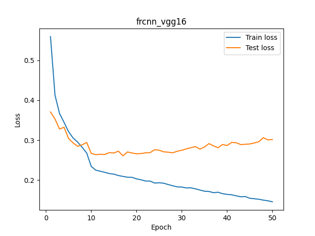
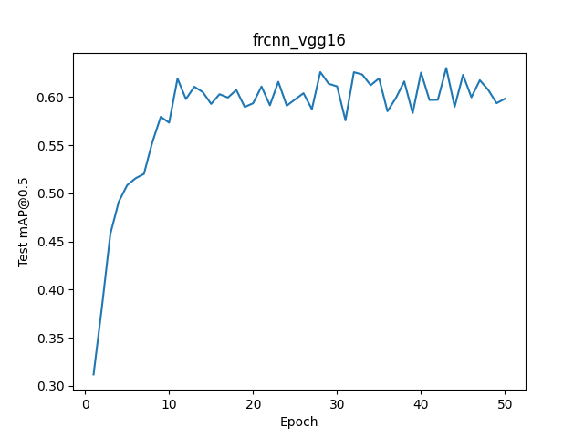
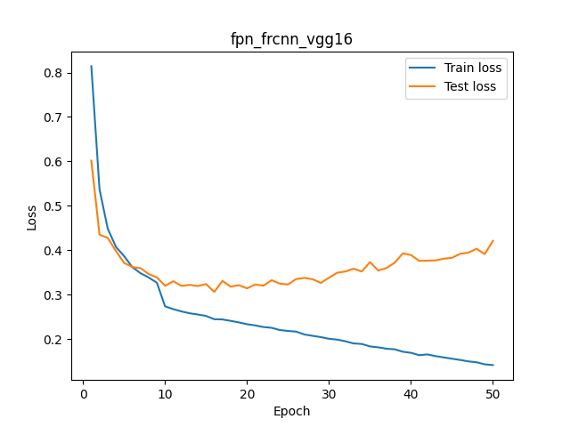
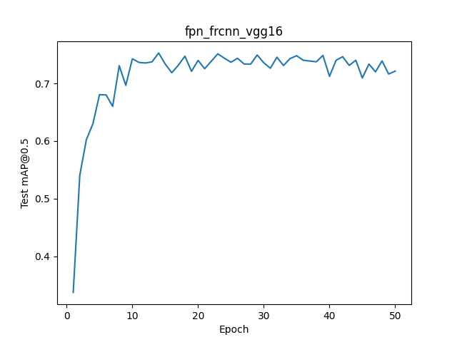
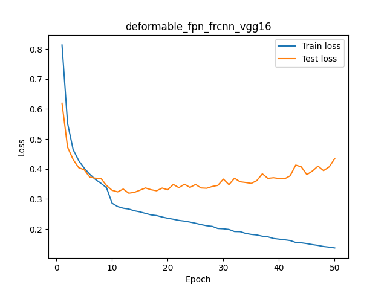
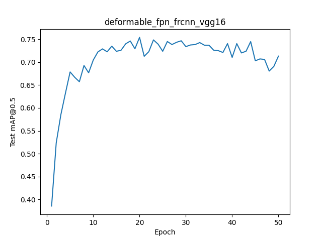

# Модификация 4

* Функция потерь (Loss): Clasification Loss (`F.cross_entropy`) + BBox Regression Loss (`smooth_l1_loss`)
* Датасет: NEU-DET 

## Baseline FRCNN VGG16

График функции потерь за 50 эпох:

График функции mAP@0.5 за 50 эпох:

* Train Loss монотонно уменьшается.
* Test Loss сначала уменьшается, после $10$ эпох выходит на плато и после $30$ эпох начинает постепенно расти.
* После $10$ эпох **mAP@0.5** выходит на плато и практически не изменяется.

1. Растущий Test Loss на $>30$ эпохе при падающем Train Loss означает переобучение.
2. На $10-30$ эпохах **mAP@0.5** находится в промежутке $0.575-0.625$.
3. **mAP@0.5** достигает максимального значения на $28$ эпохе ($62.60$).
Это и есть состояние, при котором модель полностью обучена

## VGG16 + FPN

График функции потерь за 50 эпох:

График функции mAP@0.5 за 50 эпох:

* Train Loss монотонно уменьшается.
* Test Loss сначала уменьшается, после $10$ эпох выходит на плато и после $20$ эпох начинает постепенно расти.
* После $10$ эпох **mAP@0.5** выходит на плато и практически не изменяется.

1. Растущий Test Loss на $>20$ эпохе при падающем Train Loss означает переобучение.
2. На $10-20$ эпохах **mAP@0.5** находится в промежутке $0.7-0.75$.
3. **mAP@0.5** достигает максимального значения на $14$ эпохе ($0.7528$).
Это и есть состояние, при котором модель полностью обучена

## VGG16 + DCN

График функции потерь за 50 эпох:

График функции mAP@0.5 за 50 эпох:

* Train Loss монотонно уменьшается.
* Test Loss сначала уменьшается, после $10$ эпох выходит на плато и после $20$ эпох начинает постепенно расти.
* После $10$ эпох **mAP@0.5** выходит на плато и практически не изменяется.

1. Растущий Test Loss на $>20$ эпохе при падающем Train Loss означает переобучение.
2. На $10-20$ эпохах **mAP@0.5** находится в промежутке $0.7-0.75$.
3. **mAP@0.5** достигает максимального значения на $14$ эпохе ($0.7541$).
Это и есть состояние, при котором модель полностью обучена

Ссылка на Colab с полным логом обучения: https://colab.research.google.com/drive/1a7wbUbS7Ylz5H3t6sR4_7lqh2K44bX_Y?usp=sharing